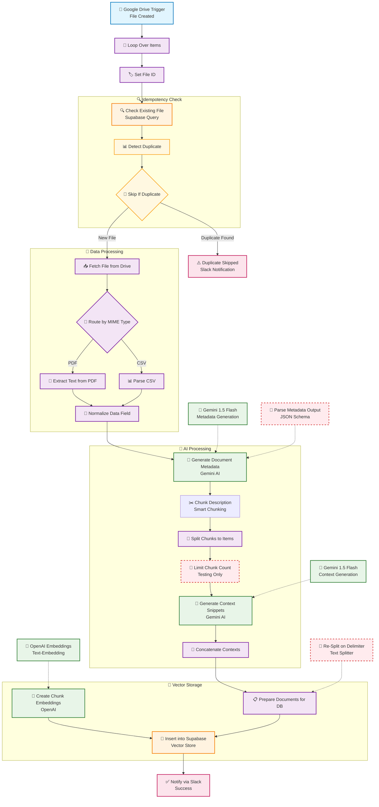

```mermaid
flowchart TD
    %% Styling
    classDef triggerNode fill:#e1f5fe,stroke:#0277bd,stroke-width:2px
    classDef processNode fill:#f3e5f5,stroke:#7b1fa2,stroke-width:2px
    classDef aiNode fill:#e8f5e8,stroke:#2e7d32,stroke-width:2px
    classDef storageNode fill:#fff3e0,stroke:#f57c00,stroke-width:2px
    classDef notificationNode fill:#fce4ec,stroke:#c2185b,stroke-width:2px
    classDef decisionNode fill:#fff8e1,stroke:#f9a825,stroke-width:2px
    classDef testingNode fill:#ffebee,stroke:#d32f2f,stroke-width:2px,stroke-dasharray: 5 5

    %% Main Flow
    A[📁 Google Drive Trigger<br/>File Created] --> B[🔄 Loop Over Items]
    B --> C[🏷️ Set File ID]
    C --> D[🔍 Check Existing File<br/>Supabase Query]
    D --> E[📊 Detect Duplicate]
    E --> F{🚦 Skip If Duplicate}
    
    %% Duplicate Path
    F -->|Duplicate Found| G[⚠️ Duplicate Skipped<br/>Slack Notification]
    
    %% Main Processing Path
    F -->|New File| H[📥 Fetch File from Drive]
    H --> I{📄 Route by MIME Type}
    
    %% File Processing
    I -->|PDF| J[📖 Extract Text from PDF]
    I -->|CSV| K[📊 Parse CSV]
    J --> L[🔧 Normalize Data Field]
    K --> L
    
    %% AI Processing
    L --> M[🤖 Generate Document Metadata<br/>Gemini AI]
    M --> N[✂️ Chunk Description<br/>Smart Chunking]
    N --> O[📝 Split Chunks to Items]
    O --> P[🧪 Limit Chunk Count<br/>Testing Only]
    P --> Q[🎯 Generate Context Snippets<br/>Gemini AI]
    Q --> R[🔗 Concatenate Contexts]
    
    %% Vector Storage
    R --> S[📋 Prepare Documents for DB]
    T[🧠 Create Chunk Embeddings<br/>OpenAI] --> U[💾 Insert into Supabase<br/>Vector Store]
    S --> U
    U --> V[✅ Notify via Slack<br/>Success]
    
    %% AI Models
    M1[🤖 Gemini 1.5 Flash<br/>Metadata Generation] -.-> M
    M2[🤖 Gemini 1.5 Flash<br/>Context Generation] -.-> Q
    M3[🔗 OpenAI Embeddings<br/>Text-Embedding] -.-> T
    
    %% Supporting Components
    S1[📐 Parse Metadata Output<br/>JSON Schema] -.-> M
    S2[📄 Re-Split on Delimiter<br/>Text Splitter] -.-> S
    
    %% Apply Styles
    class A triggerNode
    class B,C,H,I,J,K,L,O,R,S processNode
    class M,Q,T,M1,M2,M3 aiNode
    class D,U storageNode
    class G,V notificationNode
    class E,F decisionNode
    class P,S1,S2 testingNode

    %% Section Labels
    subgraph "🎯 Data Processing"
        H
        I
        J
        K
        L
    end
    
    subgraph "🤖 AI Processing"
        M
        N
        O
        P
        Q
        R
    end
    
    subgraph "💾 Vector Storage"
        S
        T
        U
    end
    
    subgraph "🔍 Idempotency Check"
        D
        E
        F
    end
```
